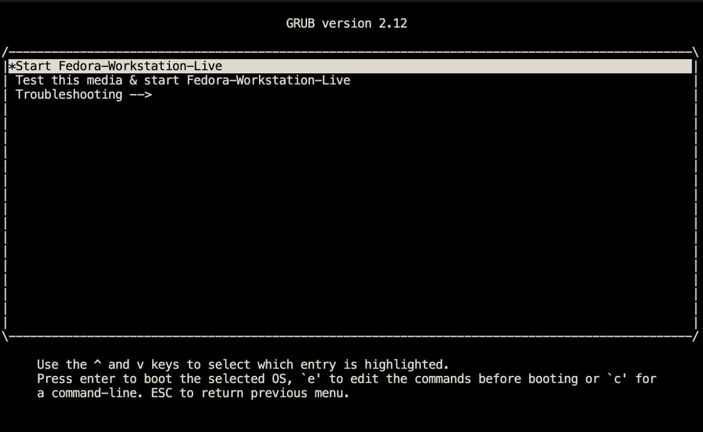
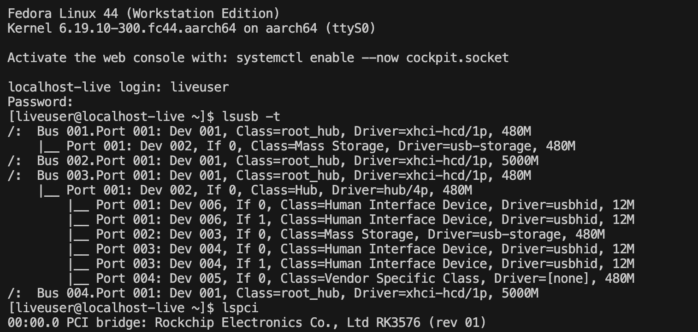
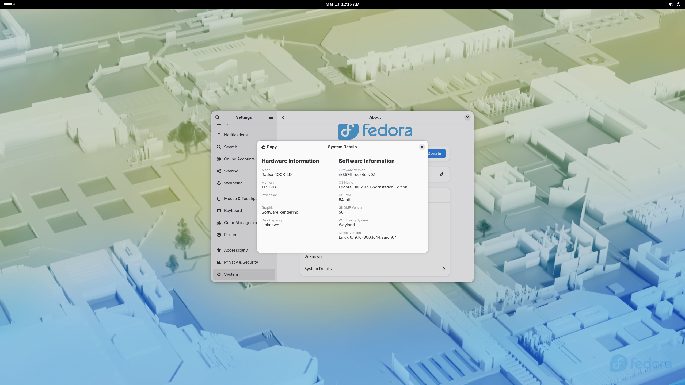

# edk2-rk3576 — UEFI for Radxa ROCK 4D (Rockchip RK3576)

[]()
[]()
[]()
[]()

A working **EDK2 / TianoCore UEFI** port for the **Radxa ROCK 4D**
(Rockchip RK3576), with a matching **TF-A BL31 + U-Boot SPL** boot stack.
Verified on real hardware (12 GB LPDDR5 SKU) booting **Fedora 44 aarch64**
to GNOME desktop.

> **Status:** chain-loads GRUB → Linux from USB; full RAM, USB 2.0, USB 3.0
> SuperSpeed, eMMC, SD, Ethernet and SMBIOS are functional. **HDMI is not
> initialised by UEFI** (no signal until Linux brings the display up), and
> **PCIe link training does not complete** under UEFI (controller is
> probed, but LTSSM never reaches L0).

---

## Screenshots

| | |
|---|---|
|  |  |
| GRUB on the Fedora 44 USB stick (renders after the kernel HDMI init) | Fedora live shell — note the `xhci-hcd 5000M` USB 3.0 root hub |



GNOME *About* identifies the board as **Radxa ROCK 4D**, firmware
**rk3576-rock4d-v0.1**, **11.5 GiB** RAM — all from the SMBIOS tables
populated by `PlatformSmbiosDxe`.

---

## Documentation → [`docs/`](docs/)

| Document                                       | What it covers                            |
|------------------------------------------------|-------------------------------------------|
| [docs/REPO_LAYOUT.md](docs/REPO_LAYOUT.md)     | What lives where in this repository       |
| [docs/HARDWARE.md](docs/HARDWARE.md)           | Hardware verification matrix, UART setup  |
| [docs/FLASHING.md](docs/FLASHING.md)           | Flashing the prebuilt firmware            |
| [docs/BUILDING.md](docs/BUILDING.md)           | Building the UEFI image from source       |
| [docs/SPI_LAYOUT.md](docs/SPI_LAYOUT.md)       | 16 MB SPI NOR layout & FIT contents       |
| [docs/KNOWN_ISSUES.md](docs/KNOWN_ISSUES.md)   | Limitations, gotchas and workarounds      |

---

## TL;DR

### Flash the prebuilt UEFI image (16 MB SPI NOR, MaskROM mode)

```bash
rkdeveloptool db   binaries/rk3576_ddr.bin
rkdeveloptool wl 0 rock4d-spi-edk2.img
rkdeveloptool rd
```

Serial console: **1,500,000 8N1** on the 3-pin debug header.
See [docs/FLASHING.md](docs/FLASHING.md) for details and recovery.

### Build from source

```bash
cd edk2_port
# Clone third-party trees once (see docs/BUILDING.md for the exact commands)
bash build_rock4d_uefi.sh
# Output: rock4d-spi-edk2.img
```

Full instructions in [docs/BUILDING.md](docs/BUILDING.md).

---

## What works

* **CPU / RAM**: 8× Cortex-A72/A53, 12 GB LPDDR5 @ 2736 MHz dual-channel
* **Boot chain**: BootROM → U-Boot SPL → FIT → TF-A BL31 (EL3) → EDK2 (EL2, BL33)
* **EDK2 services**: GIC, generic timer, runtime services, SMBIOS,
  variable services (in-RAM only — see Known Issues)
* **Storage**: eMMC, SPI NOR, SD card
* **USB 2.0 host (EHCI + OHCI)** — HID, mass-storage
* **USB 3.0 host (xHCI / DWC3 SuperSpeed)** — verified at 5 Gbps,
  enumerates SS hubs and devices in UEFI; Linux sees a `5000M` root hub
* **Network**: 1 GbE (in Linux; UEFI driver pending)
* **Boot path**: GRUB on USB stick → Fedora 44 aarch64 → GNOME 50

## What doesn't work yet

* **HDMI / display in UEFI** — `RK3576SimpleFbDxe` installs a GOP, but
  RK3576 HDMI TX PHY + VOP2 are not initialised; no signal until Linux
  takes over the display controller
* **PCIe** — RC enumerated and DBI is reachable
  (`VID:DID = 0x1D87:0x3576`), but LTSSM stays in `Polling.*` and never
  reaches L0 (`Link up timeout!`); endpoints work fine under Linux on the
  same physical slot
* **Persistent UEFI variables** — variable storage is in-RAM
  (`VariableStubDxe`), settings are lost across reboots
* **ACPI** — only stub tables, FDT mode is the supported configuration

Details and workarounds in [docs/KNOWN_ISSUES.md](docs/KNOWN_ISSUES.md).

---

## What's in the box

* `binaries/` — pre-built, hardware-verified BL31 / U-Boot / DDR-init blobs
* `rock4d-spi-edk2.img` — ready-to-flash 16 MB SPI NOR UEFI image
* `edk2_port/` — the EDK2 source overlay:
  * `Platform/Radxa/ROCK4D/` — board package
  * `Silicon/Rockchip/RK3576/` — SoC silicon package, including
    `RK3576Dxe`, `RK3576SimpleFbDxe`, `FdtPlatformDxe`,
    `Rk3576PciHostBridgeLib`, `Rk3576PciSegmentLib`
  * `build_rock4d_uefi.sh` — one-shot build script with all the GCC 10–13
    workarounds baked in

The upstream third-party trees (`edk2`, `edk2-non-osi`, `edk2-platforms`,
`arm-trusted-firmware`, `rkbin`) are **not** vendored — they are cloned at
build time. See [docs/BUILDING.md](docs/BUILDING.md).

---

## Credits

* [TianoCore EDK2](https://github.com/tianocore/edk2) — UEFI reference implementation
* [edk2-rk3588](https://github.com/edk2-porting/edk2-rk3588) — structural template for the RK3576 silicon package
* [Trusted Firmware-A](https://www.trustedfirmware.org/projects/tf-a/) — BL31
* [Radxa](https://radxa.com/products/rock4/4d/) — hardware
* [Rockchip](https://www.rock-chips.com/) — SoC and DDR init blobs

---

## License

* Repository scaffolding, build scripts, README and docs → **MIT**
  (see [LICENSE](LICENSE))
* EDK2 platform / silicon overlay code → **BSD-2-Clause-Patent** (TianoCore)
* TF-A binaries (`bl31.elf`) → **BSD-3-Clause**
* `rk3576_ddr.bin` → **Rockchip proprietary**, redistributable

See individual file headers.
