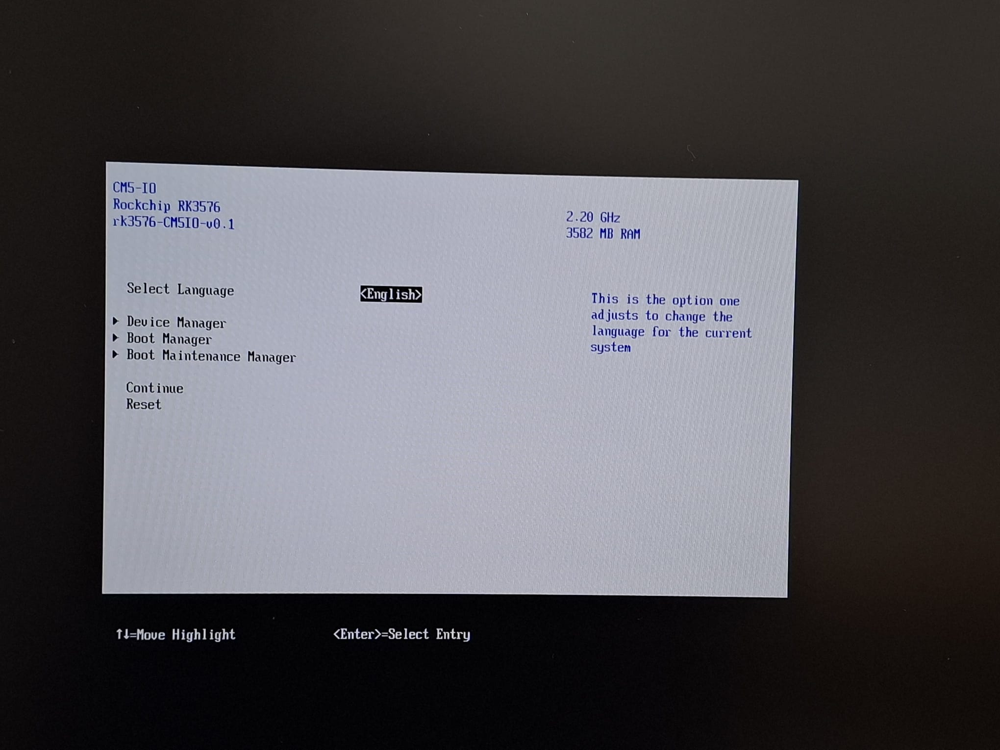

# edk2-rk3576 — UEFI for Rockchip RK3576 Boards

[]()
[]()
[]()
[](https://gahingwoo.github.io/edk2-webflash/)

Working **EDK2 / TianoCore UEFI** port for **Rockchip RK3576** SBCs.
Boots Fedora 44 aarch64 to GNOME desktop on the Radxa ROCK 4D (12 GB LPDDR5 SKU).
Hardware-verified on both the **ROCK 4D** and the **ArmSoM CM5-IO**.

---

## Screenshots

| Radxa ROCK 4D | ArmSoM CM5-IO |
|---|---|
|  |  |
| TianoCore front page at 2560×1440@60 QHD via HDMI | TianoCore on CM5-IO via HDMI (minor horizontal offset, WIP) |

| | |
|---|---|
|  |  |
| GRUB on Fedora 44 USB stick | GNOME *About* — ROCK 4D, 11.5 GiB RAM |

---

## Supported Boards

| Board | Boot medium | HDMI | eMMC | USB 3.0 | Ethernet | Status |
|---|---|---|---|---|---|---|
| Radxa ROCK 4D | SPI NOR | Working (QHD) | Working | Working (5 Gbps) | Working (UEFI + Linux) | Hardware verified |
| ArmSoM CM5-IO | SD card | WIP | Working (52 MHz HS) | Working (5 Gbps) | Working (UEFI + Linux) | Hardware verified |
| ArmSoM CM5 RPI-CM4-IO | SD card | — | Working | — | — | Build-verified |
| Waveshare CM4-IO-BASE-B | SD/SPI | — | Working | — | — | Build-verified |
| Waveshare CM4-IO-BASE-A | SD/SPI | — | Working | — | — | Build-verified |
| FriendlyElec NanoPi M5 | SPI NOR | — | — | — | — | Build-verified, no hardware |

---

## Quick Start

### Flash (ROCK 4D)

**Browser** (Chrome/Edge, no tools needed):
[**gahingwoo.github.io/edk2-webflash**](https://gahingwoo.github.io/edk2-webflash/) — hold MaskROM button, plug USB-C.

**CLI:**
```bash
rkdeveloptool db   binaries/rk3576_ddr.bin
rkdeveloptool wl 0 output/ROCK4D/ROCK4D-spi-edk2.img
rkdeveloptool rd
```

### Flash (CM5-IO)
```bash
# Write to SD card (replace /dev/sdX with your card)
dd if=output/CM5IO/CM5IO-sdcard.img of=/dev/sdX bs=1M status=progress && sync
```

Serial console: **1,500,000 8N1**.  Full instructions: [docs/FLASHING.md](docs/FLASHING.md).

### Build from source
```bash
cd edk2_port
bash build_rock4d_uefi.sh                                        # ROCK 4D
bash build_rock4d_uefi.sh --config configs/armsom-cm5-io.conf   # CM5-IO
```

See [docs/BUILDING.md](docs/BUILDING.md) for dependency setup.

---

## Documentation

| | |
|---|---|
| [docs/HARDWARE.md](docs/HARDWARE.md) | Verified hardware, UART pinout |
| [docs/FLASHING.md](docs/FLASHING.md) | Flashing prebuilt firmware |
| [docs/BUILDING.md](docs/BUILDING.md) | Building from source |
| [docs/SPI_LAYOUT.md](docs/SPI_LAYOUT.md) | SPI NOR layout |
| [docs/KNOWN_ISSUES.md](docs/KNOWN_ISSUES.md) | Limitations and workarounds |

---

## Board Details

### Radxa ROCK 4D — Hardware Verified

| Feature | Status |
|---|---|
| CPU / RAM | Working — 8-core A72+A53, 12 GB LPDDR5 @ 2736 MHz |
| eMMC / SD / SPI NOR | Working — all three storage paths |
| USB 2.0 (EHCI/OHCI) | Working — HID and mass-storage |
| USB 3.0 xHCI @ 5 Gbps (USB-A) | Working — verified |
| USB-C (SS+HS in Linux) | Working — via `phy-rockchip-usbdp.c` |
| 1 GbE (GMAC0) | Working in UEFI (PXE verified) and Linux |
| HDMI | Working — VOP2 + HDPTX PHY, EDID read, GOP at native resolution (QHD) |
| PCIe | Partial — DBI reachable, LTSSM never reaches L0 |
| SMBIOS | Working |

Boot chain: BootROM → U-Boot SPL → FIT → TF-A BL31 (EL3) → EDK2 (EL2).

---

### ArmSoM CM5-IO — Hardware Verified

> Thanks to [ArmSoM](https://www.armsom.org/) for providing a CM5-IO board for development.

The CM5 is an RPi CM4-form-factor compute module; the CM5-IO is the official carrier board.
Both boot from SD card — the carrier SPI NOR is 64 KB and cannot hold the firmware image.

| Feature | Status |
|---|---|
| eMMC (CM5 module) | Working — 52 MHz legacy HS, 8-bit; User + Boot 1/2 partitions enumerated |
| SD card | Working |
| USB 2.0 | Working |
| USB 3.0 xHCI @ 5 Gbps (USB-A) | Working — via onboard 4-port hub (DRD1) |
| USB-C (DRD0) | Not tested — DRD0 initialises HS-only in UEFI (SS PHY not brought up); untested on CM5-IO |
| 1 GbE (GMAC0, YT8531C) | Working in UEFI (PXE verified) and Linux |
| HDMI | WIP — PHY and VOP2 initialise, HPD detected, video timing output incorrect |
| EFI variables | Not persistent — carrier SPI too small; settings reset on reboot |
| PCIe | Not yet tested |

**Known limitations:**

- **EFI variables reset on reboot.** The carrier SPI NOR is 64 KB — far below the
  minimum for an NV variable store. Boot order and UEFI settings do not persist.
- **eMMC at 52 MHz legacy HS, not HS200/HS400.** The DWC eMMC CRU↔SDHCI
  frequency hand-off is architecturally incompatible with the UEFI SDHCI stack's
  clock-change sequence. 52 MHz is reliable and sufficient for OS boot.
- **HDMI output is not working yet.** The HDPTX PHY initialises and HPD is
  detected, but the VOP2 video timing output to the HDMI TX is incorrect.
  Under investigation.
- **EBBR compliance is incomplete (WIP).** Full EBBR requires persistent EFI
  variable storage; the volatile-only NV store on this carrier board does not
  meet that requirement. Work on eMMC-backed variable storage is in progress.

#### Boot method roadmap

The CM5-IO currently boots exclusively from SD card. Two additional paths are
being developed:

**eMMC boot (WIP).** The firmware will gradually gain support for booting
directly from the eMMC on the CM5 module, removing the SD card dependency
entirely.

**Mainline U-Boot on SD card.** A mainline-style U-Boot for RK3576 is available
at [github.com/gahingwoo/u-boot](https://github.com/gahingwoo/u-boot) (pending
merge to upstream). Flashing this U-Boot to the SD card provides a second boot
path alongside the UEFI image and, once UEFI transfers control to U-Boot,
restores persistent NV storage through U-Boot's own environment backend.

#### Running a mainline Linux image on CM5-IO

`rk3576-armsom-cm5-io.dts` has not yet landed in mainline Linux. Under a traditional
boot path (U-Boot without UEFI), this means the kernel has no device tree for this
board and cannot bring up its peripherals.

Under the UEFI boot path this is not a problem. The firmware compiles the board DTS
at build time and delivers the resulting DTB to the OS via the EFI DTB Configuration
Table — the same mechanism by which a PC firmware delivers ACPI tables. GRUB receives
the DTB from UEFI, passes it to the kernel, and the kernel configures its devices from
it. The kernel never looks at its own source tree for a matching DTS file.

The only prerequisite before the DTS reaches upstream is to boot via this UEFI image.
Standard distribution kernels (Fedora, Ubuntu, Arch Linux ARM) work without
modification. If building a custom kernel, ensure the following options are enabled:

```
CONFIG_PHY_ROCKCHIP_SAMSUNG_HDPTX
CONFIG_PHY_ROCKCHIP_USBDP
CONFIG_MMC_SDHCI_OF_DWCMSHC
CONFIG_STMMAC_ETH
CONFIG_XHCI_ROCKCHIP
```

Mainline 6.12 or newer is recommended; RK3576 core drivers are merged from that
release onward.

#### Build and flash

```bash
cd edk2_port
bash build_rock4d_uefi.sh --config configs/armsom-cm5-io.conf
# Output: output/CM5IO/CM5IO-sdcard.img

dd if=output/CM5IO/CM5IO-sdcard.img of=/dev/sdX bs=1M status=progress && sync
```

---

### ArmSoM CM5 RPI-CM4-IO — Build-Verified

Same GPIO routing as CM5-IO for all UEFI-relevant peripherals.
Carrier adds PCF85063a RTC and EMC2301 fan controller on I2C5.

```bash
bash build_rock4d_uefi.sh --config configs/armsom-cm5-rpi-cm4-io.conf
```

### Waveshare CM4-IO-BASE-B — Build-Verified

CM4-form-factor carrier. GPIO identical to CM5 RPI-CM4-IO (PCF85063a + EMC2301 on I2C5).

```bash
bash build_rock4d_uefi.sh --config configs/armsom-cm5-waveshare-cm4b.conf
```

### Waveshare CM4-IO-BASE-A — Build-Verified

Simplified variant: no I2C5 peripherals, FE1.1S USB hub always-on.

```bash
bash build_rock4d_uefi.sh --config configs/armsom-cm5-waveshare-cm4a.conf
```

### FriendlyElec NanoPi M5 — Build-Verified (no hardware)

Same RK3576 SoC. Key differences: 2× GbE (GMAC0 + GMAC1), RK806 on I2C1, optional UFS 2.0.

> `rk3576-nanopi-m5.dts` is not yet in mainline Linux (as of May 2026). Build the
> DTB from the FriendlyElec `nanopi6-v6.1.y` vendor kernel branch before flashing.

```bash
bash build_rock4d_uefi.sh --config configs/nanopi-m5.conf
```

---

## Known Issues

| Issue | Boards affected | Notes |
|---|---|---|
| PCIe LTSSM never reaches L0 | All | DBI reachable (`VID:DID = 0x1D87:0x3576`); works fine in Linux |
| HDMI no output | CM5-IO | VOP2/HDPTX init runs, HPD detected, video timing incorrect — WIP |
| EFI variables not persistent | CM5-IO family | Carrier SPI NOR too small; eMMC-backed NV store is WIP |
| EBBR compliance incomplete | CM5-IO family | Persistent NV storage required; WIP alongside eMMC boot path |
| USB-C HS only in UEFI | All | DRD0 initialises without SS PHY; SS+HS available in Linux via `phy-rockchip-usbdp.c` |
| USB-C untested | CM5-IO | DRD0 present in firmware but not tested on this carrier |
| ACPI tables are stubs only | All | Use the FDT (Device Tree) boot path |

---

## Credits

* [TianoCore EDK2](https://github.com/tianocore/edk2) — UEFI reference implementation
* [edk2-rk3588](https://github.com/edk2-porting/edk2-rk3588) — structural template for the RK3576 silicon package
* [Trusted Firmware-A](https://www.trustedfirmware.org/projects/tf-a/) — BL31
* [Radxa](https://radxa.com/products/rock4/4d/) — ROCK 4D hardware
* [ArmSoM](https://www.armsom.org/) — CM5-IO hardware (board provided for development)
* [Rockchip](https://www.rock-chips.com/) — SoC and DDR init blobs

---

## License

* Repository scaffolding, build scripts, README, docs — **MIT** ([LICENSE](LICENSE))
* EDK2 platform / silicon overlay code — **BSD-2-Clause-Patent** (TianoCore)
* TF-A binaries (`bl31.elf`) — **BSD-3-Clause**
* `rk3576_ddr.bin` — Rockchip proprietary, redistributable

See individual file headers.
