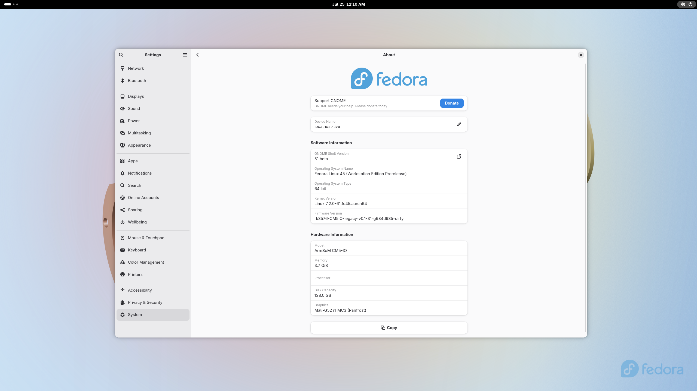
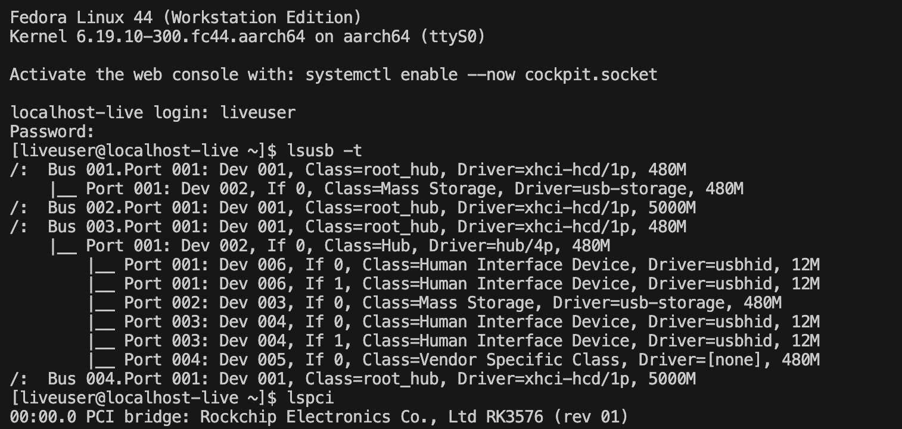

# edk2-rk3576

[]()
[](LICENSE)
[](https://gahingwoo.github.io/edk2-webflash/)

EDK2 / TianoCore UEFI firmware for Rockchip RK3576 boards.

```
BootROM → U-Boot SPL (idbloader) → TF-A BL31 → EDK2 (BL33) → OS
```

Both boards boot to the UEFI front page and load an OS. The ROCK 4D has run
Fedora 44 aarch64 through to a GNOME desktop.

## Screenshots

These are real captures from these boards, not mock-ups. Display on CM5-IO
works as of 2026-09-17; ROCK 4D's HDMI has not been retested since those fixes.
See the note below the images and [docs/STATUS.md](docs/STATUS.md).

| Radxa ROCK 4D | ArmSoM CM5-IO |
|---|---|
|  |  |
| TianoCore front page, 2560×1440@60 over HDMI | TianoCore on CM5-IO, 2560×1440@60 over HDMI |

| Radxa ROCK 4D | ArmSoM CM5-IO |
|---|---|
|  |  |
| GNOME *About* — Fedora 44, 11.5 GiB RAM | GNOME *About* — Fedora 45 Workstation, kernel 7.2, 3.7 GiB RAM, Mali-G52 via Panfrost |

| | |
|---|---|
|  |  |
| GRUB from a Fedora USB stick | Fedora live console |

| ArmSoM CM5-IO |
|---|
|  |
| Windows 10 21H2 ARM64 Setup, 2026-09-18. It had been bugchecking `ACPI_BIOS_ERROR`; the cause was an ACPI SCMI device carried over from RK3588 that drives a doorbell register this SoC does not have. Since then: the NVMe enumerates and works, all 8 CPUs come up, and the cores run at 1608 MHz. The eMMC and the SD slot still do not — those need host drivers Windows does not ship, and they live in [woa-rk3576](https://github.com/gahingwoo/woa-rk3576). See [docs/STATUS.md](docs/STATUS.md). |

> **CM5-IO: 15 of 15 cold boots.** Two fixes on 2026-09-17 closed this out —
> an SError that killed every boot before the display path ran, and RK3576's
> three per-VP mixers left at their reset values, which is what the black
> vertical stripes were. Across 15 cold boots of the fixed code every one
> reached the UEFI front page with `POST_BUF_EMPTY=0`, and the picture was
> confirmed clean by eye on the runs that were checked. The earlier "2 of 8"
> figure predates these fixes and is void; so is the sampling that produced it.
>
> **ROCK 4D now puts out a stable HDMI signal too**, and boots Fedora from an
> NVMe disk. That was a bench run with this firmware, reported 2026-09-27, but
> the serial log from it was lost, so there is no boot count and no capture
> behind it. The earlier HPD-reads-low failure is gone.

## Boards

| Board | Boot medium | Serial console | HDMI | eMMC | PCIe / NVMe | USB 3.0 | Ethernet |
|---|---|---|---|---|---|---|---|
| Radxa ROCK 4D | SPI NOR | Reliable | Working (stable signal; unlogged bench run, no count) | — (no onboard eMMC) | Working — Fedora boots from the NVMe | Working | Working |
| ArmSoM CM5-IO | SD / eMMC | Reliable | Working (15/15 cold boots) | Working (52 MHz HS, reads and writes; UEFI variables persist) | Working — Fedora boots from the NVMe | Working | Working |

Read [docs/STATUS.md](docs/STATUS.md) before anything else. It is the account
of what works, what does not, and with what sample size — every claim in it
carries its evidence. The short version: the serial console and the boot chain
are solid, and on CM5-IO the display, eMMC and PCIe all work — Fedora boots
from the NVMe. ROCK 4D's HDMI does not, and ROCK 4D has not been on a bench
since 2026-08-04, so nothing fixed since then has been checked against it.

PCIe was listed here as broken for a month after it had been fixed. Two
defects, neither of them the one the old entry was chasing: PERST# was driven
inverted, and the LTSSM was enabled after PERST# was released rather than
before. The all-ones config read that entry rested on was the endpoint being
held in reset.

## Build

```bash
scripts/setup-host.sh
scripts/build.sh   cm5io
scripts/package.sh cm5io      # -> out/CM5IO/CM5IO-sdcard.img
```

Details in [docs/BUILDING.md](docs/BUILDING.md), flashing in
[docs/FLASHING.md](docs/FLASHING.md).

## Layout

```
Platform/                    board packages
  ArmSoM/CM5IO/              DSC, PMIC/GPIO/PHY glue, ACPI tables, DTS wiring
  Radxa/ROCK4D/
Silicon/
  Rockchip/                  shared drivers and libraries
    RK3576/                  the SoC package: DSC chain, FDF, Soc.h, ACPI, drivers
    Include/RockchipIpRegs.h IP-block register layouts shared across RK3568/76/88
  Synopsys/DesignWare/       DWC EQoS and DWC MMC
boards/                      one .conf per board
scripts/                     setup-host / build / package
patches/                     our patches to the TianoCore core, applied at setup
binaries/                    BL31, DDR init blob, SPL — build inputs, ~780 KB
devicetree/mainline/         board DTS
docs/
```

A board DSC contains only what differs between boards. Everything the SoC
decides is in
[`Silicon/Rockchip/RK3576/RK3576Base.dsc.inc`](Silicon/Rockchip/RK3576/RK3576Base.dsc.inc).

## History

This tree was restructured on 2026-08-04. Before that it was a copy of the
whole `edk2-rockchip` vendor tree with RK3576 support grown inside it, and
both RK3576 boards pulled in `RK3588Platform.dsc.inc` — the RK3576
configuration was defined by subtracting from RK3588's, and five library
classes were never overridden at all, so RK3576 boards linked RK3588's
`ArmPlatformLib`, `PlatformCruLib`, `MemoryInitPeiLib`, `SaradcLib` and
`Pcie30PhyLib`.

The state immediately before the restructure is preserved on the
`legacy/v0.1` branch and the `legacy-v0.1` tag.

What that arrangement was hiding is written up in
[docs/STATUS.md](docs/STATUS.md); the short version is that `I2cDxe` had been
programming RK3588's I2C controller addresses, which on RK3576 are ordinary
DRAM.

## Licence

BSD-2-Clause-Patent, matching TianoCore and edk2-rockchip. See
[LICENSE](LICENSE).
