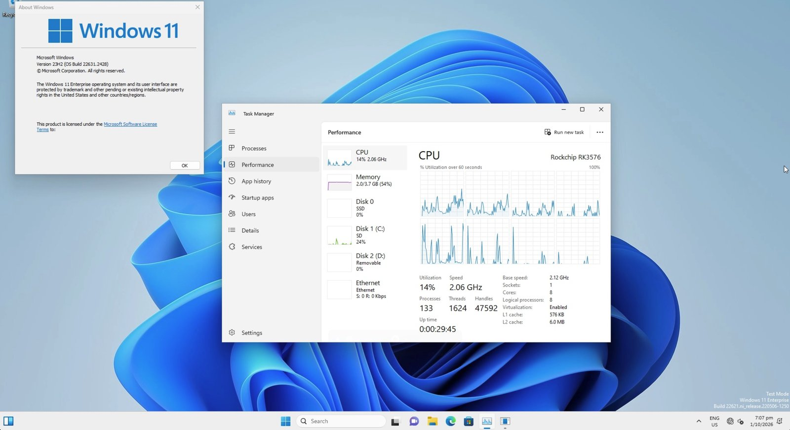

# edk2-rk3576

[]()
[](LICENSE)
[](https://flash.gahingwoo.com/)
[](https://edk2.gahingwoo.com/)

UEFI firmware (EDK2 / TianoCore) for Rockchip RK3576 boards.

```
BootROM → U-Boot SPL → TF-A BL31 → EDK2 (BL33) → OS
```

Both boards boot Fedora from NVMe. The CM5-IO also boots Windows 11 23H2 from
its eMMC, with the drivers from
[woa-rk3576](https://github.com/gahingwoo/woa-rk3576).

- Images: [latest release](https://github.com/gahingwoo/edk2-rk3576/releases/latest)
- Flash from the browser: [flash.gahingwoo.com](https://flash.gahingwoo.com/)
- Docs and screenshots: [edk2.gahingwoo.com](https://edk2.gahingwoo.com/)



## Boards

| | Radxa ROCK 4D | ArmSoM CM5-IO |
|---|---|---|
| Boots from | SPI NOR | eMMC or SD |
| HDMI | yes | yes |
| eMMC | no eMMC (UFS) | yes, UEFI variables persist |
| NVMe | yes | yes |
| USB | yes | yes; USB-C is USB 2.0 in UEFI and Windows |
| Ethernet | yes | yes, in UEFI, Linux and Windows |
| Windows 11 23H2 | not tried | boots to the desktop |

Serial console: 1500000 8N1.

## Known issues

- Windows 11 24H2 and later cannot run: RK3576 is ARMv8.0. Use Windows 10 or
  11 23H2.
- Boot entries written from an OS (`efibootmgr`, `bcdboot`) do not reach the
  firmware, and Linux logs `Unable to handle paging request in EFI runtime
  service` at reboot. Windows boots through `\EFI\Boot\bootaa64.efi` instead.
- The USB-C port has no USBDP PHY driver, so it runs at USB 2.0 outside Linux.
- The ROCK 4D has not been tested with the Windows-related changes in 0.2.0.
- The ComboPHY and PCIe device-tree fixups look for `/pcie@…` at the root,
  where mainline has `/soc/`, so they do nothing. NVMe works without them.

## Build

```bash
scripts/setup-host.sh
scripts/build.sh   cm5io
scripts/package.sh cm5io      # -> out/CM5IO/CM5IO-sdcard.img
```

[Building](docs/BUILDING.md) · [Flashing](docs/FLASHING.md) ·
[Image layout](docs/SPI_LAYOUT.md) · [Hardware](docs/HARDWARE.md)

## Layout

```
Platform/ArmSoM/CM5IO/       board package: DSC, PMIC/GPIO/PHY glue, ACPI, DTS
Platform/Radxa/ROCK4D/
Silicon/Rockchip/RK3576/     SoC package: RK3576Base.dsc.inc, FDF, ACPI, drivers
Silicon/Rockchip/            drivers shared across Rockchip SoCs
Silicon/Synopsys/DesignWare/ DWC EQoS and DWC MMC
boards/                      one .conf per board
scripts/                     setup-host, build, package
patches/                     patches to the TianoCore core, applied at setup
binaries/                    BL31, DDR init blob, SPL
devicetree/mainline/         board DTS
docs/                        the site at edk2.gahingwoo.com
```

A board DSC holds only what differs between boards. Everything the SoC decides
is in `Silicon/Rockchip/RK3576/RK3576Base.dsc.inc`.

Before 2026-08-04 this tree was a copy of edk2-rockchip that built RK3576 on
top of RK3588's configuration. That version is on the `legacy/v0.1` branch.

## Licence

BSD-2-Clause-Patent, like TianoCore and edk2-rockchip. See [LICENSE](LICENSE).
