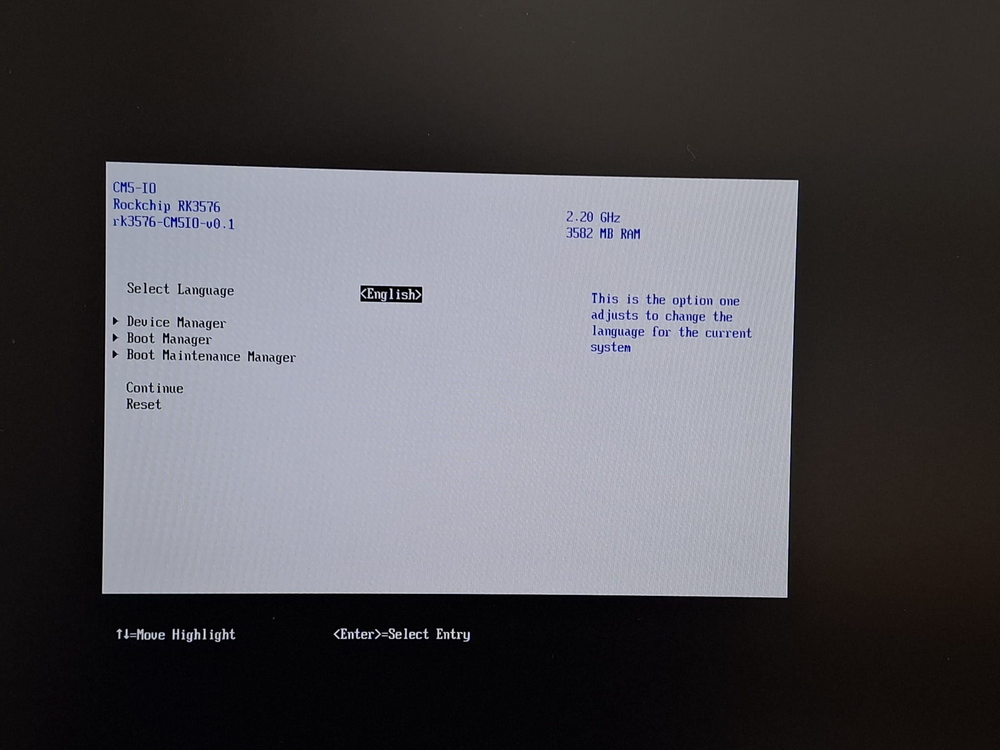
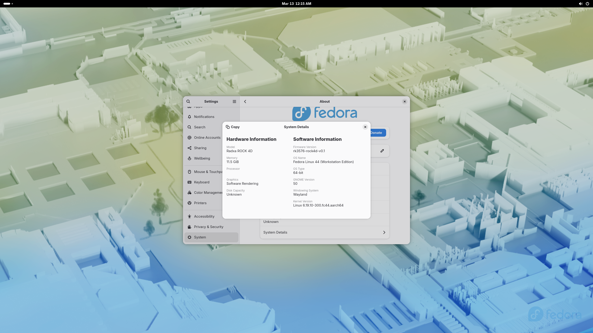
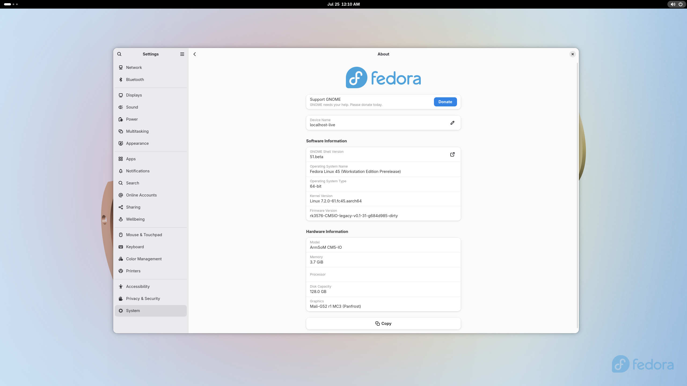
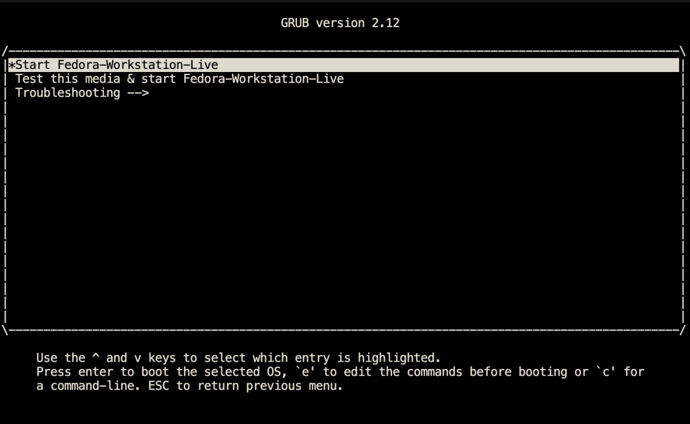
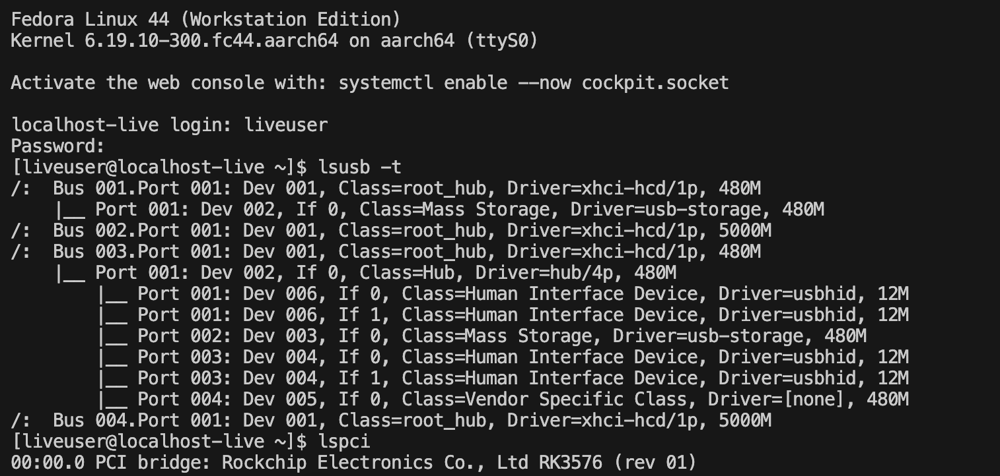

# edk2-rk3576

EDK2 / TianoCore UEFI firmware for Rockchip RK3576 boards: Radxa ROCK 4D and
ArmSoM CM5-IO.

```
BootROM → U-Boot SPL → TF-A BL31 → EDK2 (BL33) → OS
```

Both boards boot to the UEFI front page over HDMI and run Fedora from an NVMe
disk. CM5-IO also runs Windows 11 23H2 to the desktop from its eMMC.

## Get it

- **Images:** [latest release](https://github.com/gahingwoo/edk2-rk3576/releases/latest)
- **Flash from the browser:** [flash.gahingwoo.com](https://flash.gahingwoo.com/)
- **Source:** [github.com/gahingwoo/edk2-rk3576](https://github.com/gahingwoo/edk2-rk3576)

What works on each board, and the open issues, are in the
[README](https://github.com/gahingwoo/edk2-rk3576#boards).

## Screenshots

Real captures from these boards.

| Radxa ROCK 4D | ArmSoM CM5-IO |
|---|---|
|  |  |
| TianoCore front page, 2560×1440@60 over HDMI | TianoCore front page, 2560×1440@60 over HDMI |
|  |  |
| GNOME *About*: Fedora 44, 11.5 GiB RAM | GNOME *About*: Fedora 45 Workstation, kernel 7.2, 3.7 GiB RAM, Mali-G52 via Panfrost |

| | |
|---|---|
|  |  |
| GRUB from a Fedora USB stick | Fedora live console |


Windows 11 23H2 on CM5-IO, booted from the eMMC: eight cores, 3.7 GB, the eMMC
as C:, the NVMe, the SD card and Ethernet. The Windows drivers are in
[woa-rk3576](https://github.com/gahingwoo/woa-rk3576).

Fedora's *About → System Details* panel reads its model and firmware version
from the SMBIOS tables the firmware writes.

## Docs

- [Flashing](FLASHING.md): the browser tool, `rkdeveloptool`, SD card and eMMC
- [Building](BUILDING.md): host setup, dependencies, the three build scripts
- [Image layout](SPI_LAYOUT.md): byte offsets in each image, and the FIT
- [Hardware](HARDWARE.md): the board facts the firmware depends on
